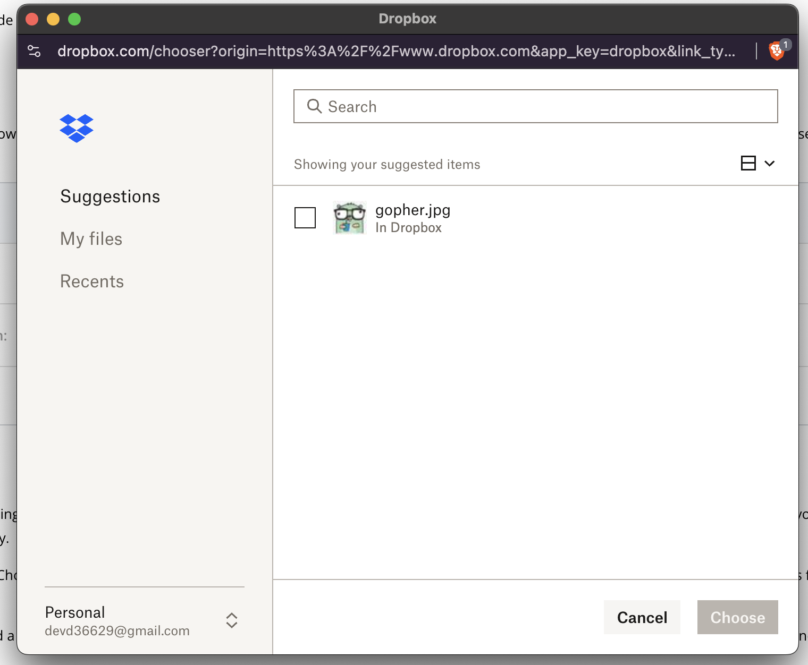

# Dropbox Chooser

The [Dropbox Chooser](https://www.dropbox.com/developers/chooser) it's a small JavaScript component that enables your app to get files from Dropbox without having to worry about the complexities of implementing a file browser, authentication, or managing uploads and storage.

> [!IMPORTANT]
> We must add the domain of our app in the **Chooser** section of our **App console**. That's the way we avoid anybody using our **app key** (will be set in the `data-app-key` attribute of the main template).

## The UI

Visually, the chooser consists in a button:


When the user clicks on it, a file chooser pops up, allowing the user to choose some files.



## Setup

Setting up the file chooser is quite simple, we just have to add a script to our **main template**:

```html
<script
  type="text/javascript"
  src="https://www.dropbox.com/static/api/2/dropins.js"
  id="dropboxjs"
  data-app-key="ypm-- YOUR APP KEY --qg2"
></script>
```

> [!IMPORTANT]
> Replace the value in the `data-app-key` attribute with your **app key**.

Then, below that script tag, we'll create another one where we can conffigure the behaviour of the file chooser:

```html
<script>
  function setUpDropbox() {
    let elem = document.getElementById("dropbox-user-form");
    if (elem == null) {
      return; // Early return
    }

    let options = {
      success: function (files) {
        alert("Here's the file link: " + files[0].link); // Debug
      },
      cancel: function () {},
      linkType: "direct", // or "preview"
      multiselect: false,
      extensions: [".jpeg", ".jpg", ".png", ".gif"],
      folderselect: false,
      sizeLimit: 1024 * 1024, // bigger files will be dimmed
    };

    let button = Dropbox.createChooseButton(options);
    elem.appendChild(button);
  }

  setUpDropbox();
</script>
```

A few things to note here:

- In the template where we want to render the button, we'll create a button with the id `dropbox-user-form`; once clicked it will trigger the dialog.
- In the `success` property, we specify the JavaScript code we want to run whenever the user selects a file in the Dropbox file chooser. At this point, clicking and uploading should show an alert saying:

```
Here's the file link:
https://dl.dropboxusercontent.com/1/view/2wkvk4exhb4zzcd/gopher.jpg
```

In the next section, we'll write a function that will create an HTML form to submit the image!

## Success

Instead of just showing the files in an alert, we want to create an input element for each selected file, append them dynamically to a form, and submit.

```js
function setUpDropbox() {
  let dropboxForm = document.getElementById("dropbox-user-form");
  if (dropboxForm == null) {
    return; // Early return
  }

  let options = {
    success: function (files) {
      for (const f of files) {
        let input = document.createElement("input");
        input.type = "hidden";
        input.value = f.link;
        dropboxForm.append(input);
      }
      // console.log(dropboxForm); // debug
      dropboxForm.submit();
    },
    cancel: function () {},
    linkType: "direct", // or "direct"
    multiselect: false,
    extensions: [".jpeg", ".jpg", ".png", ".gif"],
    folderselect: false,
    sizeLimit: 1024 * 1024, // bigger files will be dimmed
  };

  let button = Dropbox.createChooseButton(options);
  dropboxForm.appendChild(button);
}
```

## The Edit Gallery Template

In our `edit.gohtml` template, we need to create a form with the same `id` we are using in the previous script:

```html
<form
  action="/galleries/{{.ID}}/images/urls"
  method="post"
  enctype="multipart/form-data"
  id="dropbox-user-form"
>
  {{ csrfField }}
  <div class="py-2">
    <p class="block mb-2 text-sm font-semibold text-gray-800"
      >Add Images via Dropbox
      <p class="py-2 text-xs text-gray-600">Only jpg, png and gif files.</p>
    </p>
  </div>
</form>
```

## The Handler

Then, in our **backend** we have to add a handler to our galleries controller:

```go
func (g Galleries) UploadImageViaURL(w http.ResponseWriter, r *http.Request) {
	gallery, err := g.galleryById(w, r, userMustOwnGallery)
	if err != nil {
		return
	}
	err = r.ParseForm()
	if err != nil {
		http.Error(w, "invalid request", http.StatusBadRequest)
		return
	}
	files := r.PostForm["files"]
	for _, f := range files {
		fmt.Printf("Downloading %s\n", f) // TODO: implement
	}
	editPath := fmt.Sprintf("/galleries/%d/edit", gallery.ID)
	http.Redirect(w, r, editPath, http.StatusFound)
}
```

And wire it up in our `server.go`, using the same URL we use in the form in our `edit.gohtml` template.

## Downloading the Images

Right now our controller should have access to the image URLs, but the code for **downloading** the images using those URLs belongs in the **models**. So in our `models/gallery.go` let's add a `CreateImageViaURL`:

```go
func (svc *GalleryService) CreateImageViaURL(galleryId int, url string) error {
	filename := path.Base(url)
	resp, err := http.Get(url)
	if err != nil {
		return fmt.Errorf("downloading image: %w", err)
	}
	defer resp.Body.Close()
	if resp.StatusCode != http.StatusOK {
		return fmt.Errorf("downloading image - invalid status code %d", resp.StatusCode)
	}
	imageBytes, err := io.ReadAll(resp.Body)
	if err != nil {
		return fmt.Errorf("reading image bytes: %w", err)
	}
	readSeeker := bytes.NewReader(imageBytes)
	return svc.CreateImage(galleryId, filename, readSeeker)
}
```

Using it in the controller is the last step:

```go
func (g Galleries) UploadImageViaURL(w http.ResponseWriter, r *http.Request) {
	gallery, err := g.galleryById(w, r, userMustOwnGallery)
	if err != nil {
		return
	}
	err = r.ParseForm()
	if err != nil {
		http.Error(w, "invalid request", http.StatusBadRequest)
		return
	}
	files := r.PostForm["files"]
	for _, f := range files {
		fmt.Printf("Downloading %s\n", f) // TODO: implement
		// Make it work, make it better!
		err = g.GalleryService.CreateImageViaURL(gallery.ID, f)
		if err != nil {
			http.Error(w, "something went wrong creating image: "+f, http.StatusInternalServerError)
		}
	}
	editPath := fmt.Sprintf("/galleries/%d/edit", gallery.ID)
	http.Redirect(w, r, editPath, http.StatusFound)
}
```

## Refactor Slow Code

Right now, in our `models/errors.go` file, we are using a helper function named `checkContentType` that reads 512 bytes from the beginning of a file, then uses the [Seek](https://pkg.go.dev/io#Seeker.Seek) to set the offset back to the beginning of the stream.

> [!WARNING]
> This happens once per file, so large multi-file uploads pay that cost repeatedly.

We refactored the helper so it returns the **sniffed bytes** and in the **controller**, the functions that use this helper now rebuild the stream via `io.MultiReader`.

> [!WARNING]
> After this change, we gotta refactor `CreateImage`.

## Concurrent Uploads

Right now our `UploadImageViaURL` handler may have to deal with requests to create **several images**. At this point, the code in this handler may be improved so that we can create images **concurrently** instead of one after another.

```go
func (g Galleries) UploadImageViaURL(w http.ResponseWriter, r *http.Request) {
	gallery, err := g.galleryById(w, r, userMustOwnGallery)
	if err != nil {
		return
	}
	err = r.ParseForm()
	if err != nil {
		http.Error(w, "invalid request", http.StatusBadRequest)
		return
	}
	files := r.PostForm["files"]
	var wg sync.WaitGroup
	wg.Add(len(files))
	for _, f := range files {
		go func(imageUrl string) {
			err = g.GalleryService.CreateImageViaURL(gallery.ID, imageUrl)
			if err != nil {
				http.Error(w, "something went wrong creating image: "+f, http.StatusInternalServerError)
			}
			wg.Done()
		}(f) // 👈 Pass f here! ⚠️
	}
	wg.Wait()
	editPath := fmt.Sprintf("/galleries/%d/edit", gallery.ID)
	http.Redirect(w, r, editPath, http.StatusFound)
}
```

To achieve this we've used a [WaitGroup](https://pkg.go.dev/sync#WaitGroup) typically used to wait for a group of tasks (goroutines) to finish. All of these tasks will be running concurrently.

## Adding ErrGroup

The code above is a bit subpar, since the anonymous function, returns an **error response** as soon as some image fails to be created? But hey, we can only return **one response**!! The way to fix that is to collect any errors in an [errgroup](https://pkg.go.dev/golang.org/x/sync/errgroup).

> [!WARNING]
> Don't forget to install the `errgroup` package:
>
> ```
> go get golang.org/x/sync/errgroup
> ```

Then, we'll update our code to make use of it:

```go
func (g Galleries) UploadImageViaURL(w http.ResponseWriter, r *http.Request) {
	gallery, err := g.galleryById(w, r, userMustOwnGallery)
	if err != nil {
		return
	}
	err = r.ParseForm()
	if err != nil {
		http.Error(w, "invalid request", http.StatusBadRequest)
		return
	}
	files := r.PostForm["files"]
	var eg errgroup.Group
	for _, f := range files {
		eg.Go(func() error {
			return g.GalleryService.CreateImageViaURL(gallery.ID, f)
		})
	}
	err = eg.Wait()
	if err != nil {
		http.Error(w, "unable to download ALL image: ", http.StatusInternalServerError)
		return
	}
	editPath := fmt.Sprintf("/galleries/%d/edit", gallery.ID)
	http.Redirect(w, r, editPath, http.StatusFound)
}
```

## Dropbox JavaScript only on Edit page

At this point, all of our pages end up with the JavaScript code that we need only in our **edit** page. This is not a big deal in this case, since we have checks in our JavaScript code, to make sure we grab the button with id `dropbox-user-form`, before running our `setUpDropbox` function.

> [!WARNING]
> We'll also be refactoring the `ParseFS` in the `views/templage.go` file.

But at some point down the line, we may want to have a way to have JavaScript only in the pages that need it. We can achieve this using a new [action](https://pkg.go.dev/text/template#hdr-Actions) named `{{block}}`. Let's add a block in our layout (`layout.gohtml`) that our edit template can fill, and we’ll move the Dropbox scripts into `{{block "scripts" .}}…{{end}}` so they only render on the edit page before wiring it up in the templates. So in our 
