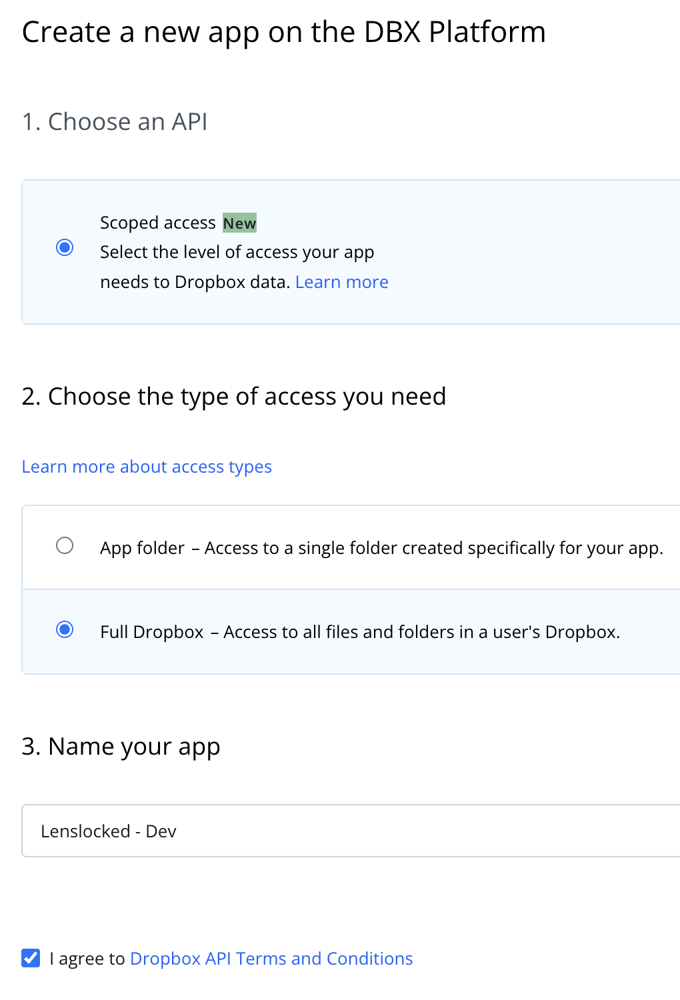
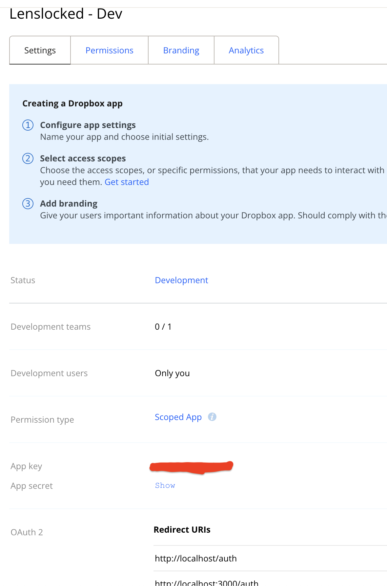
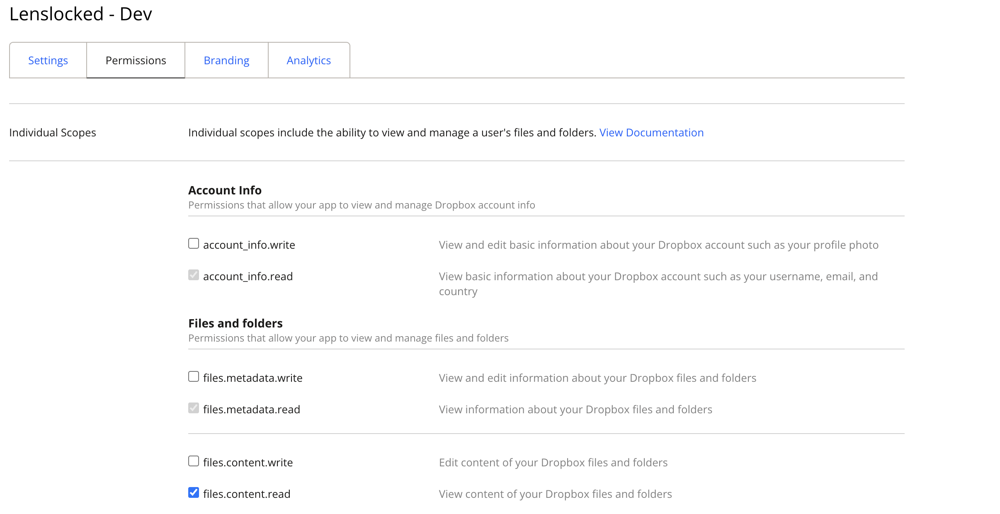
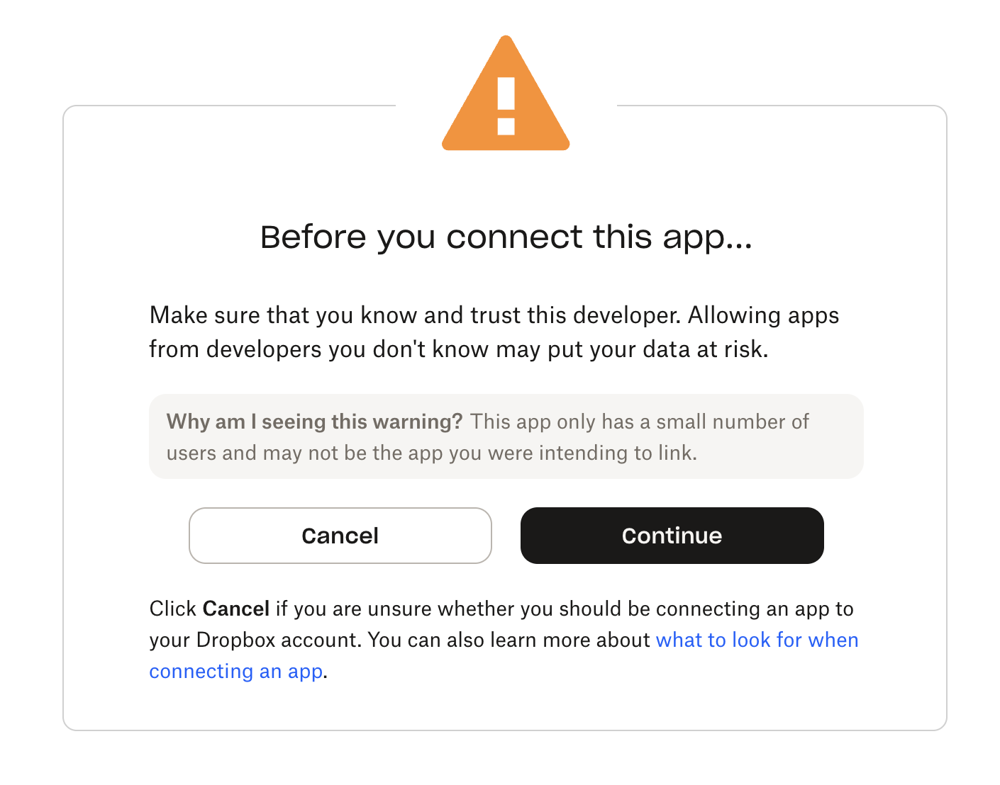
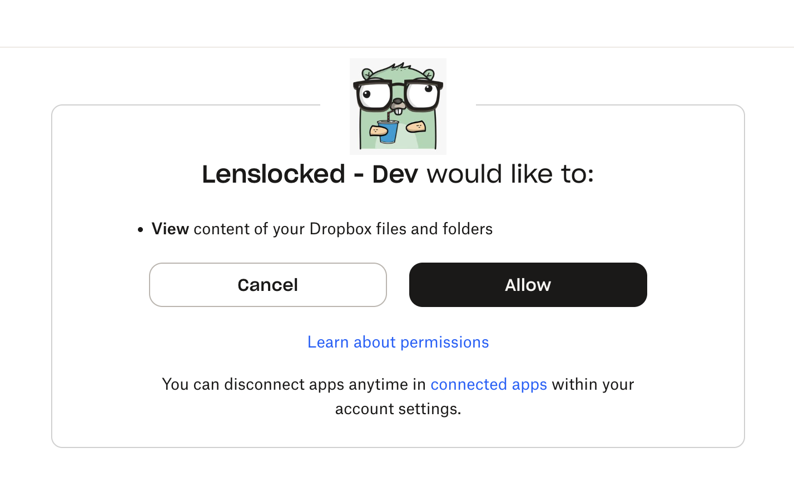
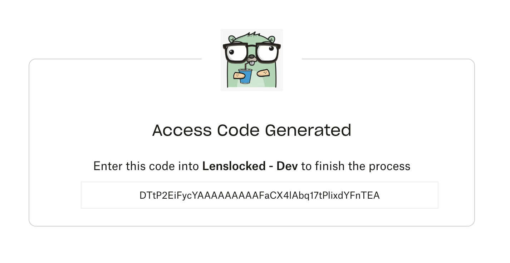

# OAuth

[OAuth. 2.0](https://datatracker.ietf.org/doc/html/rfc6749) is an open standard for **access delegation**, i.e. a way for internet users to authenticate into some webapp, by using an OAuth provider. For example, an app implementing OAuth, may offer a provider such as Google, so that user could authenticate into the app, using a token granted by Google (or other OAuth provider).

## Dropbox Provider

Let's imagine our app implements OAuth, and offers users to be able to authenticate using their Dropbox credentials. The flow goes like this:

1. User clicks on an **OAuth Dropbox** button in our app.
2. User is redirected to Dropbox, where they **authorize** our app to access limited information in their Dropbox account.
3. Once they authorize our app, they're redirected back to our website, with the **authorization code** from Dropbox.
4. Our **app** reads this code (from the URL query params), and requests an **API token** from the **Dropbox API**.
5. Once the Dropbox API responds with this token, our app can use it to access the user's Dropbox account (until access is revoked).

## OAuth Package

The [oauth2](https://pkg.go.dev/golang.org/x/oauth2) package provides support for making OAuth2 authorized and authenticated HTTP requests. It even includes a [configuration example](https://pkg.go.dev/golang.org/x/oauth2#example-Config-CustomHTTP):

```go
package main

import (
	"context"
	"fmt"
	"log"
	"net/http"
	"time"

	"golang.org/x/oauth2"
)

func main() {
	ctx := context.Background()

	conf := &oauth2.Config{
		ClientID:     "YOUR_CLIENT_ID",
		ClientSecret: "YOUR_CLIENT_SECRET",
		Scopes:       []string{"SCOPE1", "SCOPE2"},
		Endpoint: oauth2.Endpoint{
			TokenURL: "https://provider.com/o/oauth2/token",
			AuthURL:  "https://provider.com/o/oauth2/auth",
		},
	}

	// Redirect user to the consent page in the provider.
	url := conf.AuthCodeURL("state", oauth2.AccessTypeOffline)
	fmt.Printf("Visit the URL for the auth dialog: %v", url)

	// Use the authorization code that is pushed to the redirect
	var code string
	if _, err := fmt.Scan(&code); err != nil {
		log.Fatal(err)
	}

	// Use the custom HTTP client when requesting a token.
	httpClient := &http.Client{Timeout: 2 * time.Second}
	ctx = context.WithValue(ctx, oauth2.HTTPClient, httpClient)

	tok, err := conf.Exchange(ctx, code)
	if err != nil {
		log.Fatal(err)
	}

	client := conf.Client(ctx, tok)
	_ = client
}
```

Let's go over the `oauth2.Config`:

- `ClientID` is the way we have to identify the OAuth provider. We get it from the provider itself, when we register our app with them.
- `ClientSecret` is the way we have to identify our app with the OAuth provider. We also get it from the provider, when we register our app with them.
- The `Scopes` are the permissions that our app will have in the provider, once the user authorize it.
- The `Endpoint` section includes two URLs:
  1. `AuthURL` in the provider, where we send the user so she can authorize our app to access her data in the provider.
  2. `TokenURL` is where our app will request the **API token** we mentioned at the beginning.

The configuration above is something we'll be using in our code. Regarding the rest of the code:

- The `url` is set after calling the `conf.AuthCodeURL` function. The example above just print it to the terminal, but in our app, that's the URL we'll send the user so she can authorize our app with the provider.
- Once the user authorize our app, we use an `http.Client` to make a request for the **API token**. We'll be using that token each time we want to do something related with the user account in the provider.

## Dropbox as OAuth Provider

We'll be using [Dropbox](https://www.dropbox.com) as our OAuth provider, so we need to create an account with them (which you can do using our Google Account as OAuth provider 😂). Once we have an account, we have to visit [https://www.dropbox.com/developers](https://www.dropbox.com/developers), and **create an app**.


Then we have to choose the scope access and name for our app:



And take care of some configuration details:



> [!WARNING]
> Don't forget to **submit** the changes after setting up the app!

There are several pieces of info in this page, but the relevant ones for getting started are:

- **App key**, which we should use as `ClientID`.
- **App secret**, which we should use as `ClientSecret`.
- **OAuth2 - Redirect URIs**, where Dropbox will redirect the user once she authorizes our app to use her Dropbox account. We have to set this up here, for example, during local development we could use `http://localhost/oauth`.

It's a good idea to add the **app key and secret** in our `.env` and our `.env.prod` files:

```sh
DROPBOX_APP_KEY=<some-key>
DROPBOX_APP_SECRET=<some-secret>
```

Finally, in the **permissions** tab we have to make sure we tick on the `files.content.read`, so that our app can access pics from the user's Dropbox account.



## Testing the Setup

First of all, let's install the oauth2 Go Package:

```sh
go get -u golang.org/x/oauth2
```

And adapting the code sample from the beginning to make use of our config shouldn't be difficult; the [documentation](https://www.dropbox.com/developers/documentation) is quite useful, and there's also an [OAuth guide](https://developers.dropbox.com/oauth-guide):

```go
package main

import (
	"context"
	"fmt"
	"io"
	"log"
	"net/http"
	"os"
	"strings"
	"time"

	"github.com/joho/godotenv"
	"golang.org/x/oauth2"
)

func main() {
	err := godotenv.Load()
	if err != nil {
		log.Fatal("Error loading .env file")
	}
	ctx := context.Background()

	conf := &oauth2.Config{
		ClientID:     os.Getenv("DROPBOX_APP_KEY"),
		ClientSecret: os.Getenv("DROPBOX_APP_SECRET"),
		Scopes: []string{
			"files.metadata.read",
			"files.content.read",
		},
		Endpoint: oauth2.Endpoint{
			AuthURL:  "https://www.dropbox.com/oauth2/authorize",
			TokenURL: "https://api.dropboxapi.com/oauth2/token",
		},
	}

	// Redirect user to the consent page in the provider.
	url := conf.AuthCodeURL("state", oauth2.AccessTypeOffline)
	fmt.Printf("Visit the URL for the auth dialog: %v\n", url)
	fmt.Printf("Once you have the code, paste it and press enter:\n")

	// Use the authorization code that is pushed to the redirect
	var code string
	if _, err := fmt.Scan(&code); err != nil {
		log.Fatal(err)
	}

	// Use the custom HTTP client when requesting a token.
	httpClient := &http.Client{Timeout: 2 * time.Second}
	ctx = context.WithValue(ctx, oauth2.HTTPClient, httpClient)

	tok, err := conf.Exchange(ctx, code)
	if err != nil {
		log.Fatal(err)
	}

	client := conf.Client(ctx, tok)
	apiUrl := "https://api.dropboxapi.com/2/files/list_folder"
	jsonPayload := strings.NewReader(`{
		"path": "",
		"recursive": false
	}`)
	resp, err := client.Post(apiUrl, "application/json", jsonPayload)
	if err != nil {
		log.Fatal(err)
	}
	defer resp.Body.Close()
	io.Copy(os.Stdout, resp.Body)
}
```

If you run this code:

```sh
go run cmd/exp/main.go
```

We should get the output:

```
Visit the URL for the auth dialog: https://www.dropbox.com/oauth2/authorize?access_type=offline&client_id=ypmx1qg2&response_type=code&scope=files.metadata.read+files.content.read&state=state
Once you have the code, paste it and press enter:
```

We have to copy the URL, paste it in our browser where the user is logged in in her Dropbox account, and we'll see a **warning**:



We click, then the user decides if she wants to **authorize** our app:



If she authorizes our app, we'll get the code:



Copy and paste in the terminal to finish the experiment! This is the final output (prettified and redacted):

```json
{
  "entries": [
    {
      ".tag": "file",
      "name": "gopher.jpg",
      "path_lower": "/gopher.jpg",
      "path_display": "/gopher.jpg",
      "id": "id:QvDW163Du64AAAAAABg",
      "client_modified": "2026-01-06T14:53:41Z",
      "server_modified": "2026-01-06T14:53:41Z",
      "rev": "01647b9576f960c000000032621fc63",
      "size": 44732,
      "is_downloadable": true,
      "content_hash": "0737c7175e1f154c7a82f8320788273baa"
    }
  ],
  "cursor": "AmlmcFehbrWL466u7UywwbQ8Ky9QvhzKDeCospPr0",
  "has_more": false
}
```

## About the OAuth Token

In the previous code, we were using the the [Exchange](https://pkg.go.dev/golang.org/x/oauth2#Config.Exchange) function, to exchange the **authorization code** into a [token](https://pkg.go.dev/golang.org/x/oauth2#Token). this token represents the credentials used to authorize the requests to access protected resources on the OAuth 2.0 provider's backend. We could add a few lines of code to print the token once we get it:

```json
{
  "access_token": "sl.u.AG--REDACTED--Huz",
  "token_type": "bearer",
  "expiry": "2026-01-06T23:36:46.611737+02:00",
  "expires_in": 14400
}
```

The token contains 4 fields:

- The `access_token` is the token that authorizes and authenticates the requests.
- The `token_type` in this case is `bearer` which means thatr whoever bears (possesses) this token is treated as authorized
- The `expiry` is the optional expiration time of the access token.
- The `expires_in` which specifies how many seconds later (from now) the token expires.

You may have noticed that there's an **access token** but there's no **refresh token**. That shouldn't be the case, since we're using `oauth2.AccessTypeOffline` as our [AuthCodeOption](https://pkg.go.dev/golang.org/x/oauth2#AuthCodeOption)

> [!NOTE]
> In OAuth, **Online Access** means the app needs the user present (or recently active) for fresh access tokens, suitable for interactive tasks, while **Offline Access** grants a `refresh token` to get new access tokens later, enabling background work.

Using `oauth2.AccessTypeOffline` should grant a `refresh token` in the OAuth token, that we could use to get new `access tokens` later, enabling **background work** such as watching Dropbox image folders, and update our app images when new pics are added in Dropbox.

> [!TIP]
> Since the option above is not working, we could set the `token_access_type` query param manually; check the [docs](https://www.dropbox.com/developers/documentation/http/documentation) for details.

The output of our OAuth experiment should include now the `refresh_token`!

## About the AuthCodeURL

When we call , we're hardcoding the string `state` as the first argument. Actually this is a value intended to maintain state between the request and callback. In other words in our backend we could use here some generated token, that will be sent to the provider as well; if authorization succeeds, the provider will sent back the same token, so we can verify that we generated that URL.

> [!TIP]
> We could use here the CSRF token that we're using in our forms. This is not mandatory, we could use any random generated string here, as long as we verify it after (when the provider sends back the **authorization code** from the provider).

Since the main idea here is to have a way of verifying that WE initialized the OAuth process with the authorization URL, we can set the **state** in a cookie, that we later will parse, and compare with our CSRF token (or any other string).